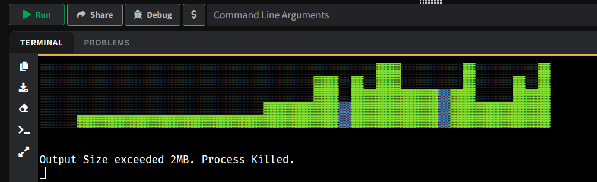

# PYTHON SORTING ALGORITHM VISUALIZATION SOFTWARE (PSAVS)

THIS CURRENTLY INCLUDES:
- COLORS!!!
- VISUALIZATION IN FOUR MODES!!!:
  - Left to right
  - Right to left
  - Top to bottom
  - Bottom to top
- TWO Rounding types (even though you shouldn't use the second one)
- A setting for MAX UNICODES PER ROW
- And of course, SORTING ALGORITHMS BLYAT:
  - BUBBLE SORT
  - SELECTION SORT
  - INSERTION SORT

Yeah I just made this project for fun... there is no real goal of it other than to practice

# IMAGE

